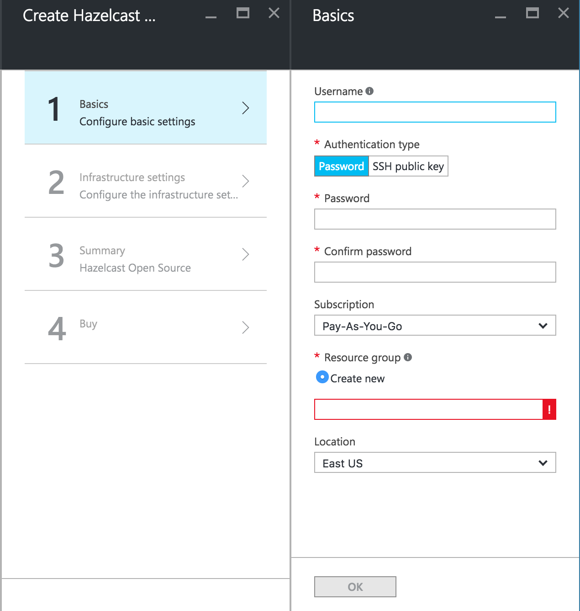
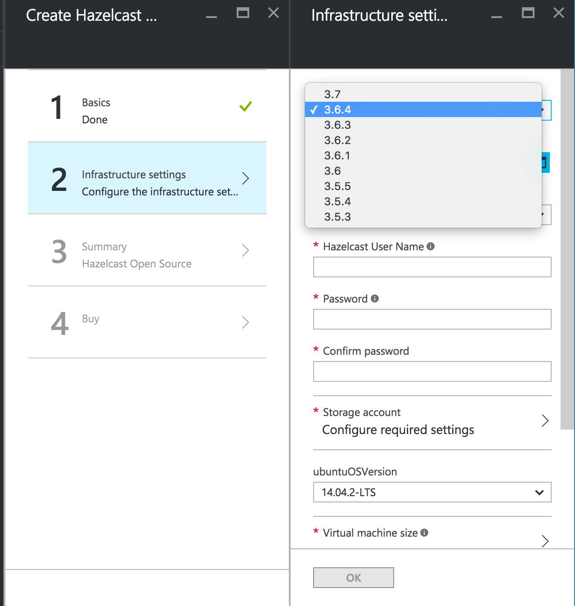
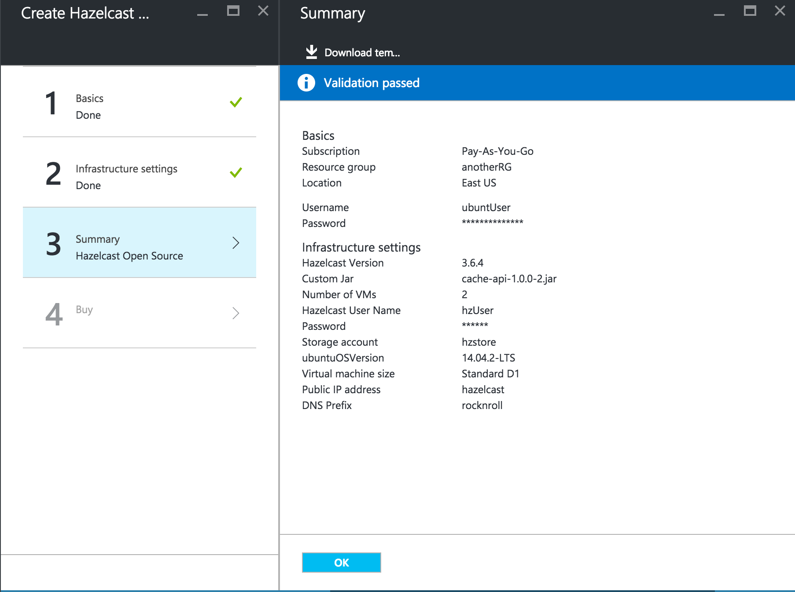
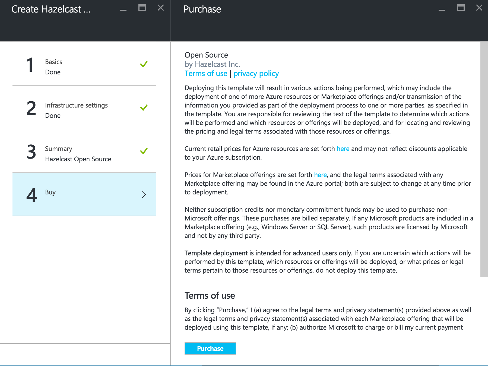

# Deploy a Hazelcast Cluster

[Hazelcast](https://hazelcast.com) is an in-memory data platform which can support a variety of data applications such as data grids, NoSQL data stores, caching and web session clustering.

This template will deploy any number of Ubuntu Hazelcast nodes in a VNet (Azure Virtual Network) using the [official Hazelcast Azure Discovery Provider](https://github.com/hazelcast/hazelcast-azure). Every node is installed with Hazelcast as an [upstart service](http://upstart.ubuntu.com/) and will continue to run even after subsequent restarts. Each node will discover every other node on the network automatically so you can add and remove nodes as you see fit.

Use the **Deploy to Azure** button above to get started.

Checkout Hazelcast's [official documentation](http://hazelcast.org/documentation/) to learn more on how to use Hazelcast.

## Azure Quickstart Guide

Hazelcast on Microsoft Azure Quick Start Guide

Getting started with Hazelcast on Microsoft Azure is as simple as four steps:

### 1. Basics

Username:	This will be the username used to login to the virtual machine

Authentication type:	Type of authentication can be SSH Public Key or Password

Password:	The password used to login to the virtual machine

SSH Public Key:	The ssh key used to login to the virtual machine

Subscription:	Which subscription used to purchase the resources

Resource group:	The resource group that will store all created resources

Location:	The region that will host all created resources

### 2. Infrastructure

Version of Hazelcast:	Which version of Hazelcast Grid to be installed

Custom Jar upload:	A custom jar to be added to each virtual machine classpath

Hazelcast user name:	The username to be used to login to Hazelcast Grid

Hazelcast password:	The password to be used to login to Hazelcast Grid

Storage account:	The storage account used for all resource storage needs

Ubuntu version:	The version of Ubuntu to be installed

Virtual machine size:	The size of each virtual machine for the Hazelcast Grid

### 3. Summary

Verify request summary. Here you can also choose to download the template parameterized json file in order to store for future reference or even use with the Azure Command Line Interface:

### 4. Deploy

Buy and deploy. Here you will be presented with Hazelcast Terms of use and privacy policy and upon agreement your Hazelcast Cluster will begin deployment:

### Inside the deployment

If you wish to investigate the deployment on any of the nodes simply login using the credentials you configured. Once you login to a node you can observe the waagent in action. waagent (Microsoft Azure Linux Agent) begins the orchestration for the downloading, configuration, and startup of Hazelcast.

Once the installation is completed you’ll observe a process ID as the final statement in the waagent.log located:

/var/lib/waagent/Microsoft.OSTCExtensions.CustomScriptForLinux-1.5.2.0/download/0

So what just happened? waagent downloaded and invoked the Hazelcast solution template to each machine. Then the solution template took the parameters from the deployment and executed a series of scripts:

bootstrap

- Created environment variables
- Calls install_hazelcast
- Calls modify_configuration
- Starts a service named hazelcast-server

### Post Deployment

In the event you wish to start or stop hazelcast-server use the service command:

service hazelcast-server stop
service hazelcast-server start
The log is located: /var/log/hazelcast-upstart.log

You know the server is ready once see the STARTED message:

